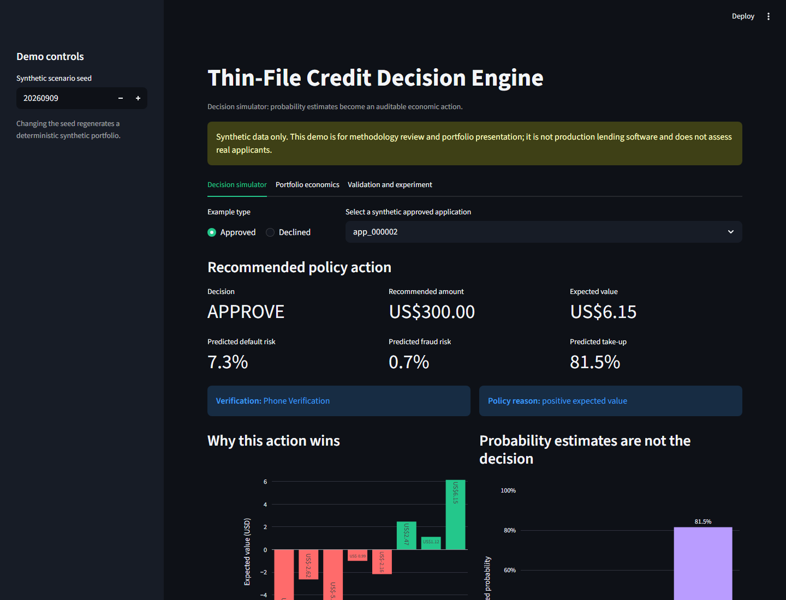

# Thin-File Credit Decision Engine

An end-to-end Decision Science system for simulated applicants with limited traditional credit history. It generates synthetic credit data, enforces point-in-time feature availability, estimates default, fraud, and take-up probabilities, then selects an approval, loan amount, and verification path using expected value.

All data is synthetic. The project is for local experimentation, methodology review, and reproducible testing; it is not production lending software.

## What it does

For each application, the engine decides whether to approve or decline, evaluates initial amounts from US$50 to US$300, chooses phone or document verification, and returns predicted default, fraud, take-up, and expected-value fields.

```yaml
application_id: app_000123
policy_version: expected_value_v1
decision: approve
approved_amount: 100
requirements: phone_verification
pd: 0.08
p_fraud: 0.02
p_take_up: 0.71
expected_value: 4.12
reason_code: positive_expected_value
```

## Architecture

```text
Synthetic data generator
  -> Point-in-time feature contract
  -> Default scorecard and XGBoost challenger
  -> Separate fraud and take-up models
  -> Expected-value policy engine
  -> Champion/challenger backtest and friction experiment
  -> JSON report
```

## Components

### Synthetic data

- `smoke`: 1,000 applications for local runs and CI.
- `full`: 50,000 applications for larger local experiments.
- Brazil, Mexico, and the Philippines; incomplete bureau data, cash flow, device signals, employment statements, and matured outcomes.

### Point-in-time safety

```text
event_timestamp <= application_timestamp
available_at <= application_timestamp
```

Default, fraud, and take-up outcomes are labels only. They cannot enter decision-time features and join training data only after their outcome window matures.

### Models and policies

- `rules_v1`: interpretable rule-based baseline.
- Logistic scorecard: default baseline with out-of-time validation.
- XGBoost challenger: calibrated before the final temporal holdout.
- Separate fraud and take-up models.
- `expected_value_v1`: selects the highest-value loan and verification scenario, or declines.

## Project structure

```text
thin-file-credit-decision-engine/
├── src/credit_engine/
│   ├── generator.py        # Synthetic source tables
│   ├── contracts.py        # Timing and label-leakage rules
│   ├── features.py         # Decision-time and matured training datasets
│   ├── modeling.py         # Logistic scorecard and temporal evaluation
│   ├── challenger.py       # Calibrated XGBoost challenger
│   ├── takeup.py           # Take-up model
│   ├── expected_value.py   # Policy selection
│   ├── backtest.py         # Economic policy comparison
│   ├── experiments.py      # Randomized friction experiment helpers
│   └── pipeline.py         # End-to-end smoke pipeline
├── tests/
├── docs/
├── reports/generated/      # Ignored JSON reports
└── .github/workflows/ci.yml
```

## Setup

```bash
git clone https://github.com/J0BS013/thin-file-credit-decision-engine.git
cd thin-file-credit-decision-engine
python -m pip install -r requirements.txt
```

## How to run

Generate source data only:

```bash
python -m credit_engine --profile smoke --output-dir data/generated/smoke
```

Run the complete smoke pipeline:

```bash
python -m credit_engine --run-mvp
```

This writes `reports/generated/mvp_summary.json` with held-out default/fraud metrics, policy-backtest output, and friction-experiment results.

## Interactive demo

Run the local Streamlit demo after installing the requirements:

```bash
streamlit run app.py
```

The demo is organized into three views:

- **Decision simulator:** compare all eight amount and verification scenarios for an approved or declined synthetic application, then inspect the selected action, expected value, probability estimates, and decision-time evidence.
- **Portfolio economics:** compare the expected-value policy with the rule-based baseline on the same matured synthetic population.
- **Validation and experiment:** review out-of-time model metrics and the randomized verification-friction experiment.

The visuals make the distinction between prediction and decision explicit: default, fraud, and take-up probabilities are inputs to the economic policy, not approval thresholds by themselves. The demo uses only generated data and is not a real-credit decision interface.



### Deployment

The application is compatible with Streamlit Community Cloud and similar Python hosting services. It uses `app.py` as the entry point, installs dependencies from `requirements.txt`, and generates its synthetic portfolio in memory at startup. No database, API key, or external dataset is required.

## How to test

```bash
python -m pytest -q
```

The suite contains 22 automated tests covering generation, grain, leakage, label maturity, temporal validation, model outputs, policy selection, backtesting, experiments, and the end-to-end smoke path. GitHub Actions runs the same critical path on pushes and pull requests.

## Assumptions and limitations

- Revenue, loss-given-default, funding, servicing, and verification costs are synthetic scenario parameters.
- Take-up/friction relationships are predictive, not causal; reduced-friction decisions require randomized evidence.
- The project does not claim real-world performance, fairness, regulatory suitability, or lending profitability.
- See the [data dictionary](docs/data_dictionary.md), [model card](docs/model_card.md), [expected-value policy](docs/expected_value_policy.md), and [experiment analysis plan](docs/experiment_analysis_plan.md).
